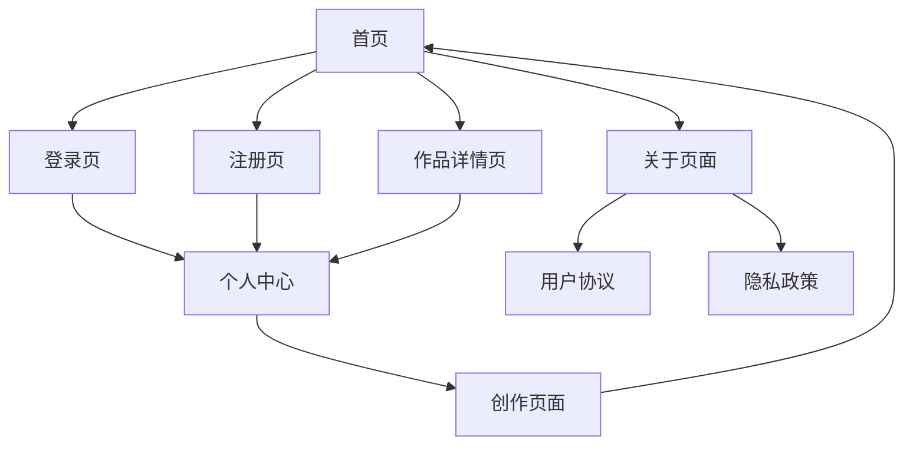

# 回中诗社产品需求文档

## 1. 产品概述

回中诗社是一个现代化的诗词创作与分享平台，为诗人、爱好者和创作者提供在线诗歌创作、阅读和交流的社区空间。

- 解决传统诗词创作缺乏现代化平台的问题，为诗词爱好者提供专业的创作和交流环境
- 目标用户包括诗词创作者、文学爱好者、传统文化传承者和学习者
- 致力于传承和发扬中华诗词文化，打造具有影响力的诗词文化社区平台

## 2. 核心功能

### 2.1 用户角色

| 角色 | 注册方式 | 核心权限 |
|------|----------|----------|
| 游客 | 无需注册 | 浏览公开诗作，查看作品详情 |
| 注册用户 | 邮箱注册 | 创作发布诗词，评论点赞，关注他人，个人主页管理 |
| 管理员 | 系统分配 | 内容审核，用户管理，系统配置，数据统计 |

### 2.2 功能模块

我们的诗社平台包含以下主要页面：

1. **首页**：诗词展示列表，分类导航，搜索功能，推荐内容
2. **登录注册页**：用户身份验证，账户创建，密码找回
3. **个人中心**：作品管理，个人信息，创作统计，关注列表
4. **创作页面**：诗词编辑器，格式工具，预览发布，草稿保存
5. **作品详情页**：诗词展示，评论互动，分享收藏，作者信息
6. **关于页面**：平台介绍，发展历程，联系方式，用户协议

### 2.3 页面详情

| 页面名称 | 模块名称 | 功能描述 |
|----------|----------|----------|
| 首页 | 诗词列表 | 展示最新、热门、推荐诗作，支持分页浏览和排序筛选 |
| 首页 | 搜索导航 | 全文搜索功能，按标题、作者、内容搜索，分类标签导航 |
| 首页 | 推荐系统 | 基于用户行为的个性化推荐，热门榜单展示 |
| 登录页 | 用户认证 | 邮箱密码登录，记住登录状态，安全验证 |
| 注册页 | 账户创建 | 用户名邮箱注册，密码强度验证，邮箱验证激活 |
| 个人中心 | 作品管理 | 查看编辑个人作品，草稿管理，发布状态控制 |
| 个人中心 | 个人信息 | 头像昵称修改，个人简介编辑，账户设置 |
| 创作页面 | 诗词编辑 | 富文本编辑器，格式化工具，实时预览功能 |
| 创作页面 | 发布管理 | 标题标签设置，发布权限控制，草稿自动保存 |
| 作品详情 | 内容展示 | 诗词正文显示，作者信息，发布时间，阅读统计 |
| 作品详情 | 互动功能 | 点赞收藏，评论回复，分享转发，举报功能 |
| 关于页面 | 平台介绍 | 网站简介，功能特色，文化使命，技术架构 |
| 关于页面 | 版本信息 | 更新记录，发展规划，技术演进，联系方式 |

## 3. 核心流程

**普通用户流程：**
游客浏览诗作 → 注册登录 → 创作诗词 → 发布作品 → 互动交流 → 个人管理

**管理员流程：**
管理员登录 → 内容审核 → 用户管理 → 数据统计 → 系统维护

## 4. 用户界面设计

### 4.1 设计风格

- **主色调**：琥珀色系 (#F59E0B) 为主色，温暖的黄色调体现诗词文化的典雅
- **辅助色**：深灰色 (#374151) 用于文本，浅灰色 (#F3F4F6) 用于背景
- **按钮样式**：圆角设计，渐变效果，悬停动画，体现现代感
- **字体**：楷体用于标题突出传统文化，无衬线字体用于正文保证可读性
- **布局风格**：卡片式设计，响应式布局，顶部导航栏，简洁优雅
- **图标风格**：线性图标配合emoji表情，增加亲和力和文化气息

### 4.2 页面设计概览

| 页面名称 | 模块名称 | UI元素 |
|----------|----------|--------|
| 首页 | 导航栏 | 琥珀色背景，白色文字，Logo居左，菜单居右，响应式折叠 |
| 首页 | 诗词卡片 | 白色背景，圆角阴影，标题楷体，内容预览，作者信息，互动按钮 |
| 首页 | 搜索区域 | 居中布局，圆角输入框，搜索按钮，分类标签，渐变背景 |
| 登录页 | 表单设计 | 居中卡片，品牌Logo，输入框圆角，主色调按钮，链接样式 |
| 个人中心 | 侧边栏 | 头像展示，菜单列表，激活状态高亮，图标配文字 |
| 创作页面 | 编辑器 | 全屏布局，工具栏顶部，预览分屏，保存状态提示 |
| 作品详情 | 内容区域 | 大标题楷体，正文居中，作者卡片，评论列表，分享按钮 |

### 4.3 响应式设计

采用移动优先的响应式设计策略，支持桌面端、平板和手机端访问，针对触屏设备优化交互体验，确保在不同设备上都能提供良好的用户体验。