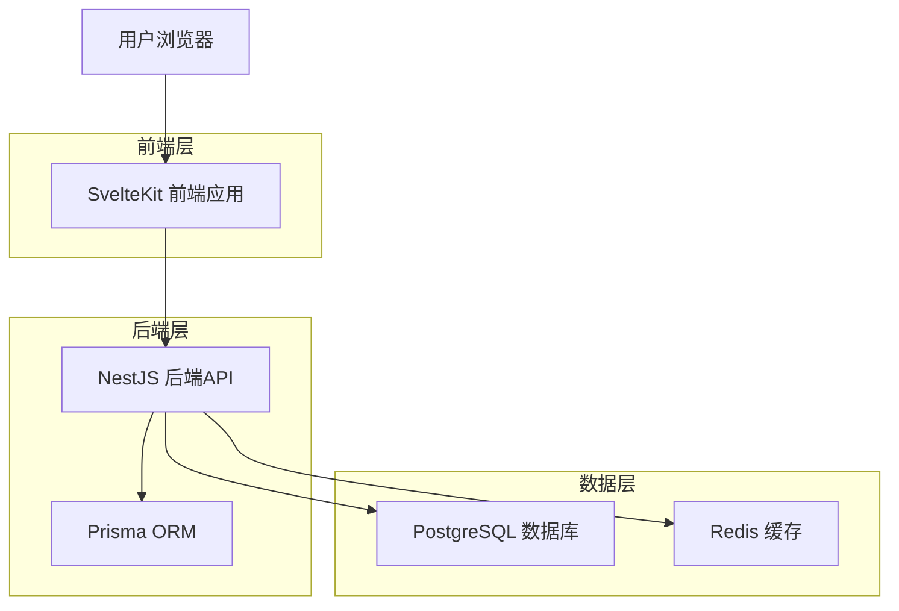
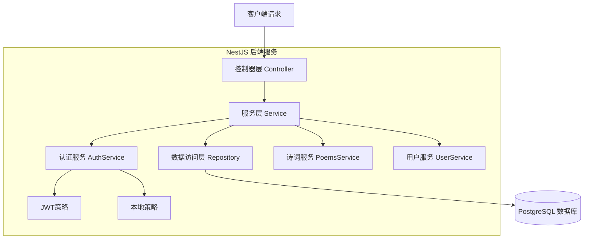
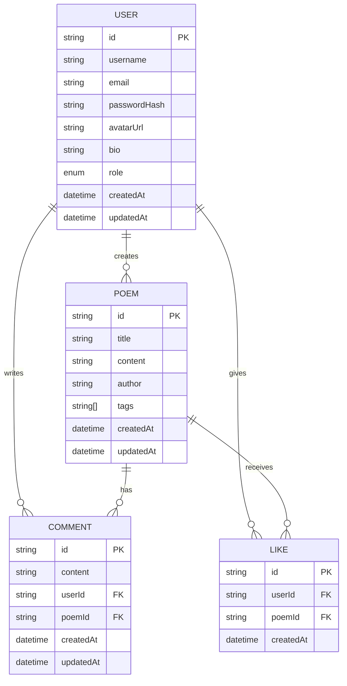

# 回中诗社技术架构文档

## 1. 架构设计



## 2. 技术描述

* **前端**: SvelteKit\@2.27.3 + TypeScript + TailwindCSS\@4.0.0 + Vite\@6.3.5

* **后端**: NestJS\@10.3.0 + Prisma\@6.11.1 + TypeScript

* **数据库**: PostgreSQL\@15 + Redis\@7

* **部署**: Docker + Docker Compose

* **包管理**: pnpm + Turborepo (Monorepo)

## 3. 路由定义

| 路由        | 用途             |
| --------- | -------------- |
| /         | 首页，展示诗词列表和导航功能 |
| /login    | 登录页面，用户身份验证    |
| /register | 注册页面，新用户账户创建   |
| /about    | 关于页面，平台介绍和版本信息 |
| /privacy  | 隐私政策页面，数据保护说明  |
| /terms    | 用户协议页面，使用条款和规范 |

## 4. API定义

### 4.1 核心API

**用户认证相关**

```
POST /api/auth/login
```

请求参数:

| 参数名      | 参数类型   | 是否必需 | 描述     |
| -------- | ------ | ---- | ------ |
| email    | string | true | 用户邮箱地址 |
| password | string | true | 用户密码   |

响应参数:

| 参数名           | 参数类型   | 描述      |
| ------------- | ------ | ------- |
| access\_token | string | JWT访问令牌 |
| user          | object | 用户基本信息  |

示例:

```json
{
  "email": "user@example.com",
  "password": "password123"
}
```

**用户注册**

```
POST /api/auth/register
```

请求参数:

| 参数名      | 参数类型   | 是否必需 | 描述   |
| -------- | ------ | ---- | ---- |
| username | string | true | 用户名  |
| email    | string | true | 邮箱地址 |
| password | string | true | 密码   |

**诗词管理**

```
GET /api/poems
POST /api/poems
GET /api/poems/:id
PUT /api/poems/:id
DELETE /api/poems/:id
```

**用户管理**

```
GET /api/users/profile
PUT /api/users/profile
GET /api/users/:id
```

**评论和点赞**

```
POST /api/poems/:id/comments
POST /api/poems/:id/likes
DELETE /api/poems/:id/likes
```

## 5. 服务器架构图



## 6. 数据模型

### 6.1 数据模型定义



### 6.2 数据定义语言

**用户表 (users)**

```sql
-- 创建用户表
CREATE TABLE users (
    id UUID PRIMARY KEY DEFAULT gen_random_uuid(),
    username VARCHAR(50) UNIQUE NOT NULL,
    email VARCHAR(255) UNIQUE NOT NULL,
    password_hash VARCHAR(255) NOT NULL,
    avatar_url VARCHAR(500),
    bio TEXT,
    role VARCHAR(20) DEFAULT 'User' CHECK (role IN ('Admin', 'User')),
    created_at TIMESTAMP WITH TIME ZONE DEFAULT NOW(),
    updated_at TIMESTAMP WITH TIME ZONE DEFAULT NOW()
);

-- 创建索引
CREATE INDEX idx_users_email ON users(email);
CREATE INDEX idx_users_username ON users(username);
CREATE INDEX idx_users_created_at ON users(created_at DESC);
```

**诗词表 (poems)**

```sql
-- 创建诗词表
CREATE TABLE poems (
    id UUID PRIMARY KEY DEFAULT gen_random_uuid(),
    title VARCHAR(200) NOT NULL,
    content TEXT NOT NULL,
    author VARCHAR(100) NOT NULL,
    tags TEXT[],
    created_at TIMESTAMP WITH TIME ZONE DEFAULT NOW(),
    updated_at TIMESTAMP WITH TIME ZONE DEFAULT NOW()
);

-- 创建索引
CREATE INDEX idx_poems_title ON poems(title);
CREATE INDEX idx_poems_author ON poems(author);
CREATE INDEX idx_poems_created_at ON poems(created_at DESC);
CREATE INDEX idx_poems_tags ON poems USING GIN(tags);
```

**评论表 (comments)**

```sql
-- 创建评论表
CREATE TABLE comments (
    id UUID PRIMARY KEY DEFAULT gen_random_uuid(),
    content TEXT NOT NULL,
    user_id UUID NOT NULL REFERENCES users(id) ON DELETE CASCADE,
    poem_id UUID NOT NULL REFERENCES poems(id) ON DELETE CASCADE,
    created_at TIMESTAMP WITH TIME ZONE DEFAULT NOW(),
    updated_at TIMESTAMP WITH TIME ZONE DEFAULT NOW()
);

-- 创建索引
CREATE INDEX idx_comments_poem_id ON comments(poem_id);
CREATE INDEX idx_comments_user_id ON comments(user_id);
CREATE INDEX idx_comments_created_at ON comments(created_at DESC);
```

**点赞表 (likes)**

```sql
-- 创建点赞表
CREATE TABLE likes (
    id UUID PRIMARY KEY DEFAULT gen_random_uuid(),
    user_id UUID NOT NULL REFERENCES users(id) ON DELETE CASCADE,
    poem_id UUID NOT NULL REFERENCES poems(id) ON DELETE CASCADE,
    created_at TIMESTAMP WITH TIME ZONE DEFAULT NOW(),
    UNIQUE(user_id, poem_id)
);

-- 创建索引
CREATE INDEX idx_likes_poem_id ON likes(poem_id);
CREATE INDEX idx_likes_user_id ON likes(user_id);
CREATE INDEX idx_likes_created_at ON likes(created_at DESC);
```

**初始化数据**

```sql
-- 插入管理员用户
INSERT INTO users (username, email, password_hash, role, bio) VALUES 
('admin', 'admin@poetryclub.com', '$2b$10$example_hash', 'Admin', '回中诗社管理员');

-- 插入示例诗词
INSERT INTO poems (title, content, author, tags) VALUES 
('春晓', '春眠不觉晓，处处闻啼鸟。夜来风雨声，花落知多少。', '孟浩然', ARRAY['春天', '古诗', '田园']);
```

