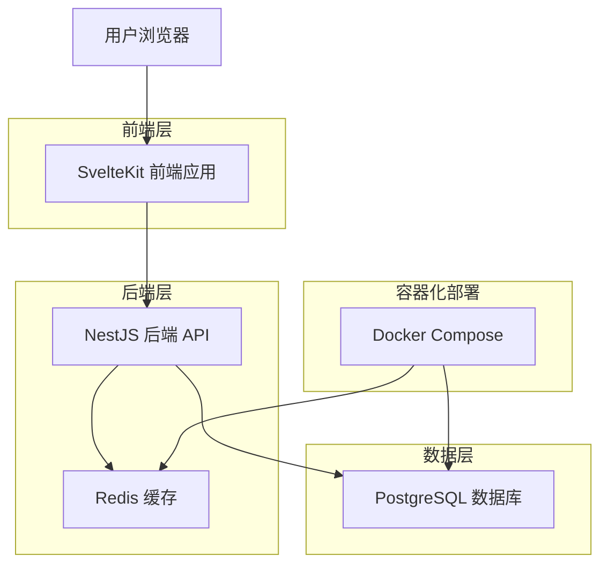
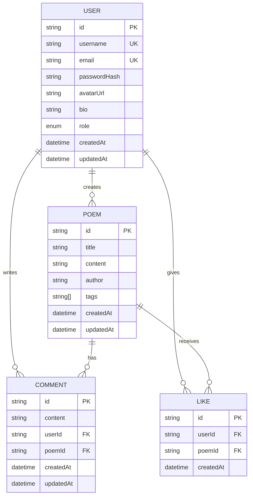

# 📋 回中诗社 - 技术架构文档

## 1. 架构设计

### 1.1 整体架构



### 1.2 架构特点

- **前后端分离**：采用现代化的前后端分离架构，提高开发效率和系统可维护性
- **微服务友好**：基于模块化设计，便于后续扩展为微服务架构
- **容器化部署**：使用 Docker 容器化部署，确保环境一致性
- **类型安全**：全栈 TypeScript 开发，提供完整的类型安全保障

## 2. 技术栈说明

### 2.1 前端技术栈

| 技术 | 版本 | 用途 | 选择理由 |
|------|------|------|----------|
| **SvelteKit** | 2.x | 前端框架 | 轻量级、高性能、开发体验优秀 |
| **Svelte** | 5.x | UI 框架 | 编译时优化、运行时性能卓越 |
| **DaisyUI** | 5.x | UI 组件库 | 基于 Tailwind CSS，组件丰富 |
| **Tailwind CSS** | 4.x | CSS 框架 | 原子化 CSS，开发效率高 |
| **Tiptap** | 2.x | 富文本编辑器 | 现代化、可扩展的编辑器 |
| **Vite** | 6.x | 构建工具 | 快速的开发服务器和构建 |
| **TypeScript** | 5.x | 类型系统 | 提供类型安全和更好的开发体验 |

### 2.2 后端技术栈

| 技术 | 版本 | 用途 | 选择理由 |
|------|------|------|----------|
| **NestJS** | 10.x | 后端框架 | 企业级框架，模块化设计 |
| **Prisma** | 5.x | ORM 工具 | 类型安全的数据库访问 |
| **PostgreSQL** | 16.x | 主数据库 | 功能强大的关系型数据库 |
| **Redis** | 7.x | 缓存数据库 | 高性能缓存和会话存储 |
| **JWT** | - | 身份认证 | 无状态的身份验证方案 |
| **Passport** | - | 认证中间件 | 灵活的认证策略 |
| **Zod** | 4.x | 数据验证 | 类型安全的数据验证库 |

### 2.3 开发工具

| 工具 | 版本 | 用途 | 选择理由 |
|------|------|------|----------|
| **pnpm** | 10.x | 包管理器 | 高效的磁盘空间利用和依赖管理 |
| **Turborepo** | 2.x | 构建系统 | 高效的 Monorepo 构建工具 |
| **ESLint** | 9.x | 代码检查 | 保证代码质量和一致性 |
| **Prettier** | 3.x | 代码格式化 | 统一的代码格式 |
| **Docker** | - | 容器化 | 环境一致性和部署便利性 |

## 3. 路由定义

### 3.1 前端路由

| 路由 | 页面 | 功能描述 | 权限要求 |
|------|------|----------|----------|
| `/` | 首页 | 展示热门诗歌和平台介绍 | 公开 |
| `/login` | 登录页 | 用户登录 | 游客 |
| `/register` | 注册页 | 用户注册 | 游客 |
| `/forgot-password` | 忘记密码 | 密码重置申请 | 游客 |
| `/reset-password` | 重置密码 | 密码重置确认 | 游客 |
| `/write` | 创作页 | 诗歌创作和编辑 | 登录用户 |
| `/poem/[id]` | 诗歌详情 | 查看诗歌详情和评论 | 公开 |
| `/user/[id]` | 用户主页 | 查看用户信息和作品 | 公开 |
| `/profile` | 个人资料 | 编辑个人信息 | 登录用户 |
| `/my-poems` | 我的作品 | 管理个人作品 | 登录用户 |
| `/favorites` | 收藏夹 | 查看收藏的作品 | 登录用户 |
| `/settings` | 设置页 | 账户设置和偏好 | 登录用户 |
| `/about` | 关于页 | 平台介绍和帮助信息 | 公开 |

### 3.2 API 路由

| 路由 | 方法 | 功能描述 | 权限要求 |
|------|------|----------|----------|
| `/api/auth/login` | POST | 用户登录 | 公开 |
| `/api/auth/register` | POST | 用户注册 | 公开 |
| `/api/auth/refresh` | POST | 刷新令牌 | 公开 |
| `/api/users/profile` | GET/PUT | 获取/更新用户资料 | 登录用户 |
| `/api/users/:id` | GET | 获取用户信息 | 公开 |
| `/api/poems` | GET/POST | 获取诗歌列表/创建诗歌 | 公开/登录用户 |
| `/api/poems/:id` | GET/PUT/DELETE | 诗歌详情/更新/删除 | 公开/作者 |
| `/api/poems/:id/like` | POST/DELETE | 点赞/取消点赞 | 登录用户 |
| `/api/poems/:id/comments` | GET/POST | 获取/添加评论 | 公开/登录用户 |
| `/api/health` | GET | 健康检查 | 公开 |

## 4. 数据模型设计

### 4.1 数据库 ER 图



### 4.2 数据表定义

#### 用户表 (users)
```sql
CREATE TABLE users (
    id UUID PRIMARY KEY DEFAULT gen_random_uuid(),
    username VARCHAR(50) UNIQUE NOT NULL,
    email VARCHAR(255) UNIQUE NOT NULL,
    password_hash VARCHAR(255) NOT NULL,
    avatar_url TEXT,
    bio TEXT,
    role user_role DEFAULT 'User',
    created_at TIMESTAMP WITH TIME ZONE DEFAULT NOW(),
    updated_at TIMESTAMP WITH TIME ZONE DEFAULT NOW()
);

CREATE TYPE user_role AS ENUM ('Admin', 'User');
```

#### 诗歌表 (poems)
```sql
CREATE TABLE poems (
    id UUID PRIMARY KEY DEFAULT gen_random_uuid(),
    title VARCHAR(100) NOT NULL,
    content TEXT NOT NULL,
    author VARCHAR(100) NOT NULL,
    tags TEXT[],
    created_at TIMESTAMP WITH TIME ZONE DEFAULT NOW(),
    updated_at TIMESTAMP WITH TIME ZONE DEFAULT NOW()
);
```

#### 评论表 (comments)
```sql
CREATE TABLE comments (
    id UUID PRIMARY KEY DEFAULT gen_random_uuid(),
    content TEXT NOT NULL,
    user_id UUID NOT NULL REFERENCES users(id) ON DELETE CASCADE,
    poem_id UUID NOT NULL REFERENCES poems(id) ON DELETE CASCADE,
    created_at TIMESTAMP WITH TIME ZONE DEFAULT NOW(),
    updated_at TIMESTAMP WITH TIME ZONE DEFAULT NOW()
);
```

#### 点赞表 (likes)
```sql
CREATE TABLE likes (
    id UUID PRIMARY KEY DEFAULT gen_random_uuid(),
    user_id UUID NOT NULL REFERENCES users(id) ON DELETE CASCADE,
    poem_id UUID NOT NULL REFERENCES poems(id) ON DELETE CASCADE,
    created_at TIMESTAMP WITH TIME ZONE DEFAULT NOW(),
    UNIQUE(user_id, poem_id)
);
```

## 5. 安全架构

### 5.1 身份认证

- **JWT 令牌**：使用 JSON Web Token 进行无状态身份验证
- **刷新令牌**：实现令牌自动刷新机制，提高安全性
- **密码加密**：使用 bcrypt 进行密码哈希存储
- **会话管理**：基于令牌的会话管理，支持多设备登录

### 5.2 权限控制

- **基于角色的访问控制 (RBAC)**：支持管理员和普通用户角色
- **资源级权限**：用户只能操作自己的资源
- **API 权限验证**：所有敏感操作都需要身份验证

### 5.3 数据安全

- **输入验证**：使用 Zod 进行严格的数据验证
- **SQL 注入防护**：使用 Prisma ORM 防止 SQL 注入
- **XSS 防护**：前端输出转义，防止跨站脚本攻击
- **CORS 配置**：合理配置跨域资源共享策略

## 6. 性能优化

### 6.1 前端优化

- **代码分割**：使用 SvelteKit 的自动代码分割
- **懒加载**：组件和路由的按需加载
- **静态资源优化**：图片压缩和 CDN 加速
- **缓存策略**：合理的浏览器缓存配置

### 6.2 后端优化

- **数据库索引**：为常用查询字段添加索引
- **查询优化**：使用 Prisma 的查询优化功能
- **Redis 缓存**：缓存热点数据和会话信息
- **连接池**：数据库连接池管理

### 6.3 部署优化

- **容器化部署**：使用 Docker 确保环境一致性
- **负载均衡**：支持水平扩展
- **CDN 加速**：静态资源 CDN 分发
- **监控告警**：完善的监控和告警机制

## 7. 扩展性设计

### 7.1 模块化架构

- **前端组件化**：可复用的 Svelte 组件
- **后端模块化**：NestJS 模块化设计
- **共享代码包**：前后端共享的类型定义和工具函数

### 7.2 API 版本管理

- **版本控制**：支持 API 版本管理
- **向后兼容**：保证 API 的向后兼容性
- **文档同步**：API 文档与代码同步更新

### 7.3 未来扩展

- **微服务架构**：支持拆分为微服务
- **消息队列**：支持异步任务处理
- **搜索引擎**：集成 Elasticsearch 全文搜索
- **AI 功能**：集成 AI 辅助创作功能

---

*本文档版本：v1.0*  
*最后更新：2025年1月*